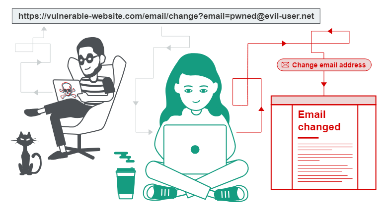

# Laboratoire de Démonstration CSRF



## Configuration

1. Installer Docker et Docker Compose
2. Cloner ce répertoire
3. Lancer l'environnement :
   ```bash
   docker-compose up -d
   ```

## Accès aux Services

- Site Web Vulnérable CSRF : http://localhost:8080
- Site Attaquant : http://localhost:8081

## Scénario de Test

1. Connectez-vous sur le site web vulnérable, tel un utilisateur normal
2. Ouvrez le site attaquant **dans un nouvel onglet**. 
Vous pouvez y voir un formulaire de transfert d'argent.
Ce site est contrôlé par un attaquant et a été envoyé à l'utilisateur imprudent.
3. Observez le transfert automatique **sans consentement**
4. Vérifiez les transferts dans le fichier transferts.log
4. Mettez en place une protection CSRF sur le site web vulnérable

## Objectifs Pédagogiques

- Comprendre le mécanisme CSRF
- Identifier les vulnérabilités de sécurité
- Mettre en place des protections